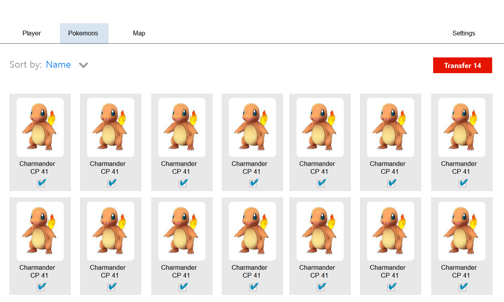
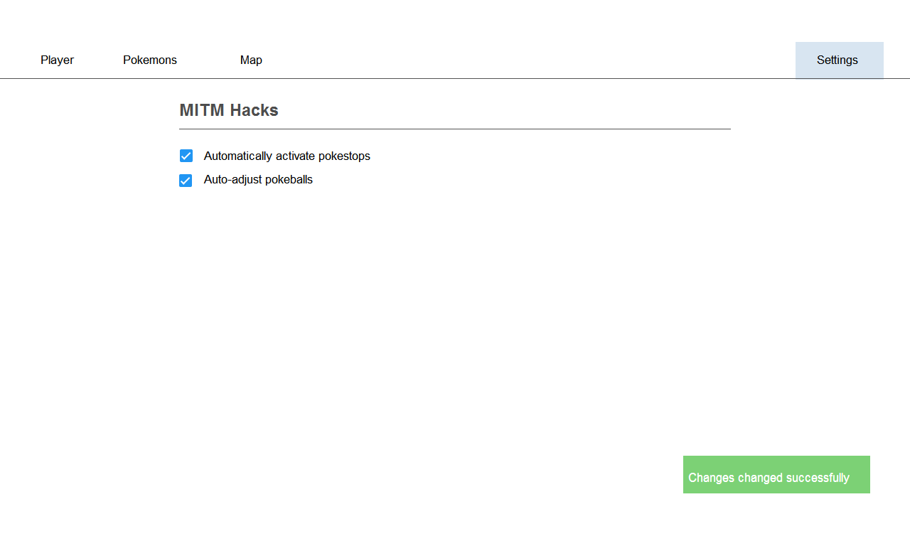

# Pokemon Go Enhanced

## The Dream

It's really simple in essence.
We're making Pokemon Go more awesome
by giving an edge over others
(face it, that's why most are here)
but still making it fun to play
by actually going out there.
We're augmenting the experience.

All you have to do is start up the proxy
and connect to it,
everything works magically
and you decide what to do next.
You can go out there in the field
and use the game-enhancing features
from within your app,
or connect to the freshly started
webserver to investigate your pokemons,
bulk transfer or evolve those pidgeys,
you name it.
We hand you the tools, you decide.

This repository will contain a single-deploy suite
of nifty little things that together
will make up Pokemon Go Enhanced.
What follows is a little overview of features.

### Will definitely happen
- [x] Pokeballs always hit
- [x] Auto-interacting with Pokestops in range (kinda)
- [ ] Bulk transfer pokemon through UI (bye Pidgeotto)
- [ ] Bulk evolve pokemon (get those Pidgeys and Weedles)
- [ ] Extended visibility within the app
- [ ] Web-based UI to configure everything listed here.
Hosted on a per-person basis.
- [ ] UI includes a map of all nearby pokemon
- [ ] In-app clues to nearby pokemons

### Brainstorming
- [ ] Auto-dodge attacks
- [ ] Auto-catch everything within range
- [ ] UI allows walking to/fixing a location e.g. by tapping a location
- [ ] Auto-occupy empty gyms

As you should see from these lists,
the goal is to augment the Pokemon Go experience
but still keeping it an experience.
The player will get to decide in how far
she wants to cheat.

## How: The Tech
Woah so how will we accomplish all of these magnificent things?
We've got it all figured out right here, just need to implement it.
The proof of concept will exist of:

- Node.js `v6.3`
- MITM attacks: [rastapasta's pokemongo-mitm](https://github.com/rastapasta/pokemon-go-mitm-node.git)
- Automated API calls: No decent lib out yet so generating my own
- UI: Being designed and scaffolded as we speak

### Requirements

- Node `v6.3` or similar. I use [nvm](https://github.com/creationix/nvm) to switch.
- Protobuf 3 can be a real bitch to install. It's absolutely required though, for now. Get it at https://github.com/google/protobuf/releases

## Setup
```
➜ git clone git@github.com:rubenvereecken/PokemonGo-Enhanced.git
➜ cd PokemonGo-Enhanced
➜ npm install
```

Now, you'll need to generate an SSL certificate that your phone trusts.
Right now this is done by starting the server once, we'll make this easier though.

Just start the server and kill it using `Ctrl+C`
```
➜ node index.js
[+++] PokemonGo MITM Proxy listening on 8080
[!] Make sure to have the CA cert .http-mitm-proxy/certs/ca.pem installed on your device
```

Do as it says, copy the certificate to your phone and install it.
If you don't know how, follow instructions at https://support.google.com/nexus/answer/2844832

### Customization

Customize it using environmental variables:
```
EXPRESS_PORT=3030 PROXY_PORT=3031 node index.js
```

## Contribution
Where do you come in you ask?
Well we would love your help!

Join us on [Slack](https://pkre.slack.com) 
([invite](https://shielded-earth-81203.herokuapp.com))
in the channel `#enhanced`
to have a chat on what part of the project you'd love to help with.
Everyone's welcome: from web dev to TCP sleuth.
We even have this designer guy hanging around.

More info at [the wiki](https://github.com/rubenvereecken/PokemonGo-Enhanced/wiki/Contributing)!

## Current Mockups


